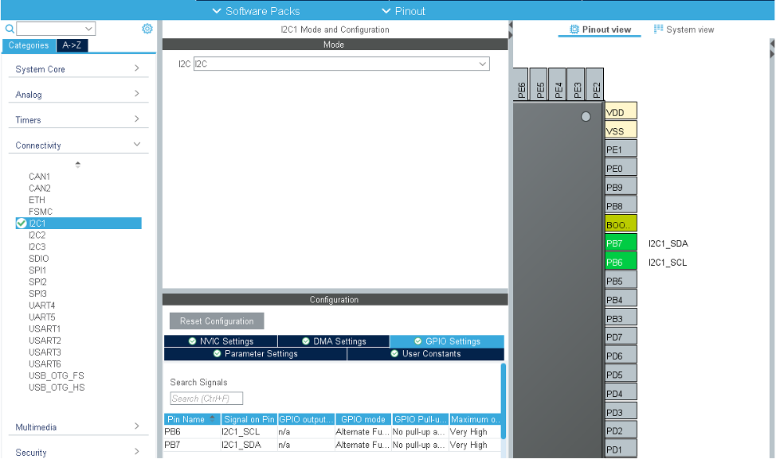
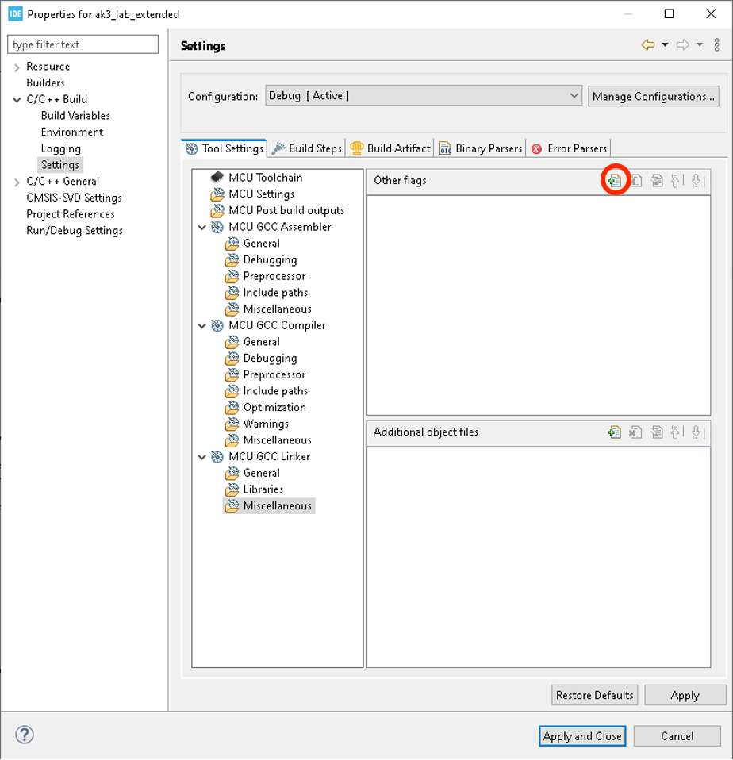
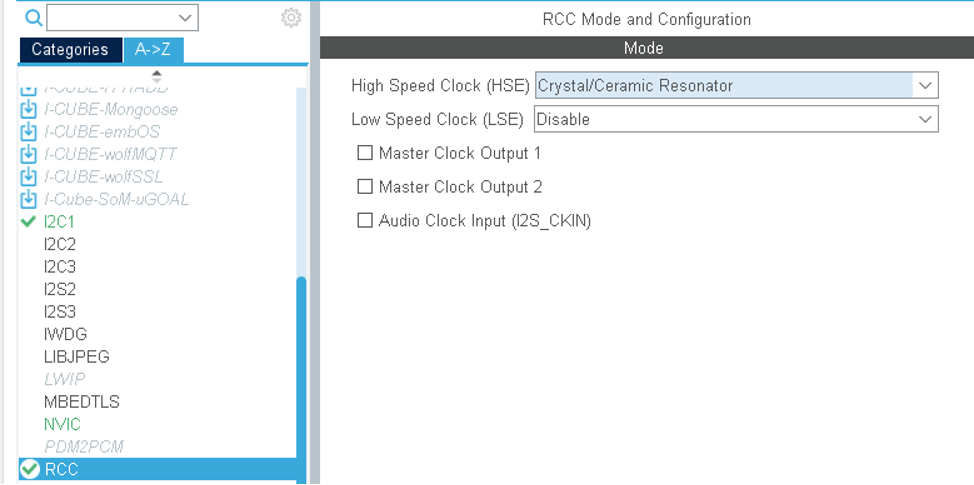
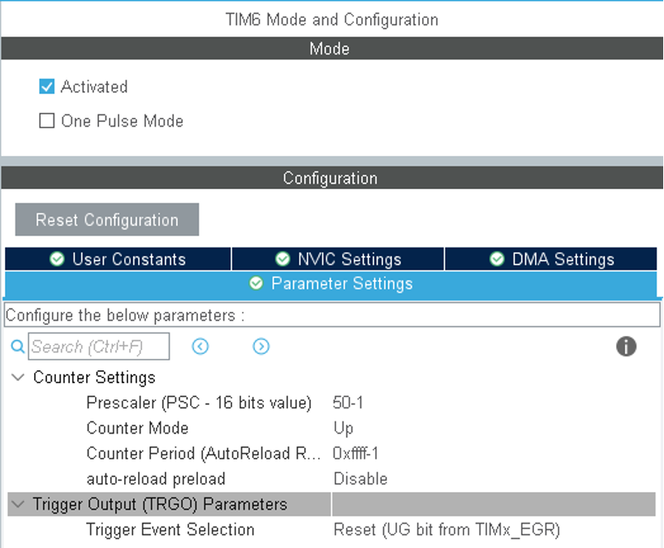
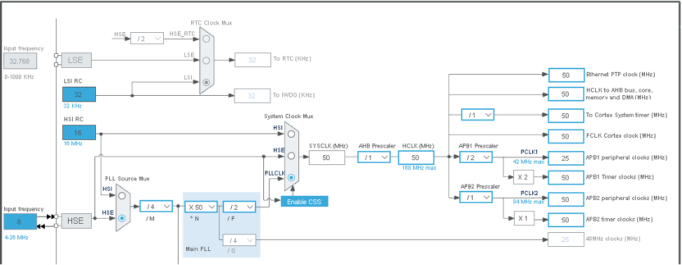
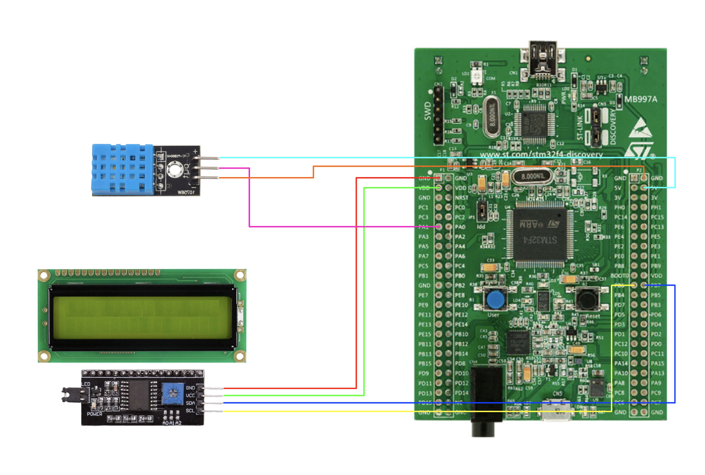

# My embedded project with LCD 16x2 display, DHT11 sensor and STM32F407G-DISC1 board
The project was done in STM32CubeIDE, and the provided instructions are specifically designed for this environment.

To get started, open STM32CubeIDE, click **Start new STM32 project**, then find microcontroller for your board in **Board Selector**. Click **Next**, come up with **Project Name** and then press **Finish**.

Then we need to set up our project environment. In a file of the **.ioc** type, go to the **Pinout & Configuration** tab, and in the **Connectivity** section, find **I2C1** and configure it as shown in the screenshot.

The pins PB6 and PB7 are automatically connected; we can leave them as it is. Save and generate the code. Additionally, to enable the display of floating-point numbers on the screen, we will take the following steps:
  1. Right-click on the project name and select **Properties** from the context menu.
  2. In the **C/C++ Build** section, select **Settings**.
  3. In the **MCU GCC Linker** section, choose **Miscellaneous** and click on the **Add…** button.

  4. In the pop-up window, enter `-u_printf_float`, then click **Ok** and **Apply and Close**.

This is just enough for the lcd display configuration. Now let's, let's implement interaction with the DHT11 sensor. In the **.ioc** file, we will configure the RCC:

In the **Pinout & Configuration** tab, in the section, we select TIM6 and configure the delays:

Next, in the **Pinout view**, we will find pin PA1 and set it to GPIO_Output. This pin will be used by the board to receive data from the sensor. Now, click on the **Clock Configurations** tab. Set the **Input frequency** to 8 MHz. In **PLL Source Mux** and **System Clock Mux**, select **HSE** and **PLCLK**, respectively. Finally, enter 50 MHz in **HCLK**. The final configurations should look like this:

Enjoy!

# Structural diagram

# Documentation
[Discovery STM32 board](https://www.st.com/en/evaluation-tools/stm32f4discovery.html)

[LCD 16x2 Display](https://www.vishay.com/docs/37484/lcd016n002bcfhet.pdf)

[DHT11 Sensor](https://components101.com/sensors/dht11-temperature-sensor)
